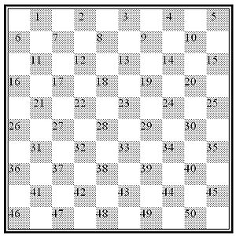

# Draughts Game Kata
This is a TypeScript implementation of the famous board game Draughts

## Rules

### Starting position
* The game is played on a board with 10×10 squares, alternating dark and light. The lower-leftmost square should be dark.
* Each player has 20 pieces. In the starting position (see illustration) the pieces are placed on the first four rows closest to the players. This leaves two central rows empty.

### Moves and captures
* The player with the light pieces moves first. Then turns alternate.
* Ordinary pieces move one square diagonally forward to an unoccupied square.
* Enemy pieces can and must be captured by jumping over the enemy piece, two squares forward or backward to an unoccupied square immediately beyond. If a jump is possible it must be done, even if doing so incurs a disadvantage.
* Multiple successive jumps forward or backward in a single turn can and must be made if after each jump there is an unoccupied square immediately beyond the enemy piece. It is compulsory to jump over as many pieces as possible. One must play with the piece that can make the maximum number of captures.
* A jumped piece is removed from the board at the end of the turn. (So for a multi-jump move, jumped pieces are not removed during the move, they are removed only after the entire multi-jump move is complete.)
* The same piece may not be jumped more than once.

### Crowning
* A piece is crowned if it stops on the far edge of the board at the end of its turn (that is, not if it reaches the edge but must then jump another piece backward). Another piece is placed on top of it to mark it. Crowned pieces, sometimes called kings, can move freely multiple steps in any direction and may jump over and hence capture an opponent piece some distance away and choose where to stop afterwards, but must still capture the maximum number of pieces possible.

### Winning and draws
* A player with no valid move remaining loses. This occurs if the player has no pieces left, or if all the player's pieces are obstructed from moving by opponent pieces.
* A game is a draw if neither opponent has the possibility to win the game.
* The game is considered a draw when the same position repeats itself for the third time (not necessarily consecutive), with the same player having the move each time.
* A one king against one king endgame is automatically declared a draw, as is any other position proven to be a draw.

## Notation
Each of the fifty dark squares has a number (1 through 50). Number 46 is at the left corner seen from the player with the light pieces. Number 5 is at the left corner seen from the player with the dark pieces.

